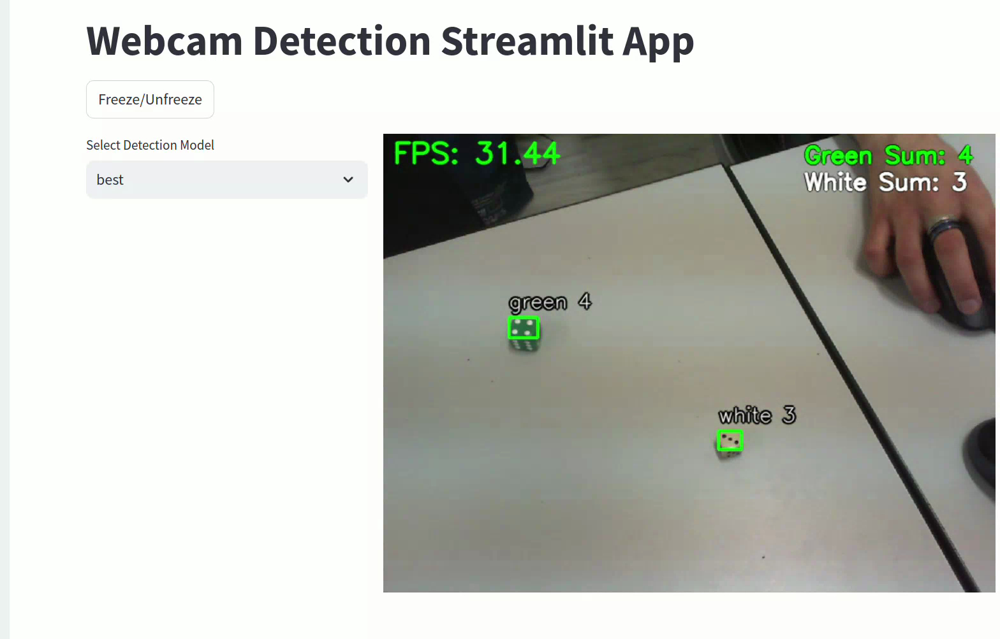
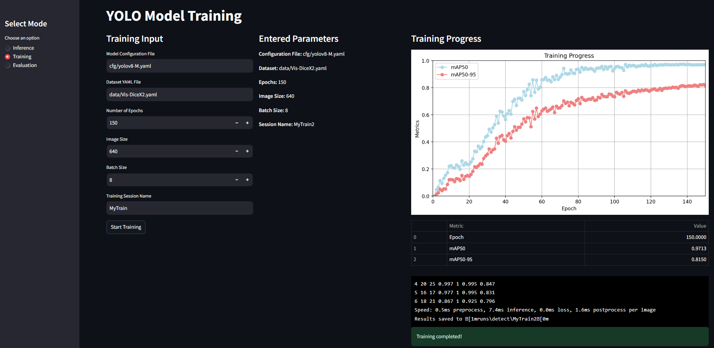
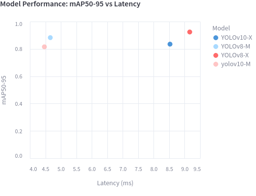

# Vis-DiceX<sup>2</sup>: Computer Vision techniques for Dice in 2D images 
> Vis-Dice<sup>2</sup> is a web-based computer vision tool built with Streamlit. It includes three core functionalities: **Inference**, **Training**, and **Evaluation** of pre-trained models to detect dice sides. Additionally, it identifies the color and calculates the sum of visible dice of that color.

---

## Contents
1. [Features](#features)
   - [Compatibility](#compatibility)
   - [Inference](#inference)
   - [Training](#training)
   - [Evaluation](#evaluation)
2. [Requirements](#requirements)
3. [Execution Guide](#execution-guide)
   - [Install Pre-Trained Model Weights](#install-pre-trained-model-weights)
   - [Create the Environment](#create-the-environment)
   - [Install PyTorch](#install-pytorch)
   - [Install Dependencies](#install-dependencies)
   - [Run the Code](#run-the-code)
   - [Train your own model](#train-your-own-model)
   - [Evaluate Models](#evaluate-models)
4. [To Do](#to-do)


---

## Features
#### Compatibility:
This project should be compatible in both windows and linux, however, it should perform more smoothly in linux due to some internal subprocess problems with windows.
### Inference
Perform real-time inference using pre-trained YOLO models directly within the web tool. Select a model from the list of pre-trained models available [here](https://drive.google.com/drive/folders/14hduF6_zP0yVD9t2IzsBDQ6UFfifeM7M?usp=sharing).



### Training
Train your own model using [Ultralytics](https://github.com/ultralytics) and monitor training progress through real-time graphs.



### Evaluation
> Evaluate pre-trained models or your own custom models. Visualize evaluation results as graphs.

<div align="center">
    
</div>

---

## Requirements

- **Python**: 3.10
- **CUDA Toolkit**: Compatible with PyTorch
- **Torch**: Required for deep learning operations

---

## Execution Guide

### Install Pre-Trained Model Weights
Download the pre-trained YOLO weights from [Google Drive](https://drive.google.com/drive/folders/14hduF6_zP0yVD9t2IzsBDQ6UFfifeM7M?usp=sharing) and move them into the `models/` folder:

```bash
cd VisDiceX2
mkdir models
```

### Create the Environment
Create and activate a Conda environment:

```bash
conda create -n visdicex2 python=3.10 -y
conda activate visdicex2
```

### Install PyTorch
Install PyTorch and CUDA libraries (CUDA version: 12.4):

```bash
conda install pytorch torchvision torchaudio pytorch-cuda=12.4 -c pytorch -c nvidia
```

Verify that PyTorch is installed with CUDA (for GPU support):

```bash
python utils/check_torch_cuda.py
```

### Install Dependencies
Install the required Python dependencies:

```bash
pip install -r requirements.txt
```

### Run the Code
Start the Streamlit app:

```bash
streamlit run Vis-DiceX2.py
```

### Train your own model
Initially, you want to make sure everything is set up correctly to start your own training. 
- Confirm the correctness of the parameter *`path`* in *`data/Vis-DiceX2.yaml`*. If your system already had ultralytics previously, using an absolute path to the dataset may resolve internal errors (e.g. absolute-path/Vis-DiceX2/dataset/dice-dataset*`)
- if label/image paths are incorrect run the folowing code, once executed move files in *`split-dataset`* folder to *`dataset/dice-dataset`*.
```bash
python utils/split_dataset.py
```

You can train your own model by running Vis-DiceX2.py [[Run the Code](#run-the-code)].

Alternatively, (recommended as your first option) you can perform manual training using the below command:
```bash
python train.py --cfg cfg/yolov8-M.yaml --data data/Vis-DiceX2.yaml --epochs 150 --imgsz 640 --batch 8 --name MyTrain-yolov8m
```

### Evaluate models
To evaluate pre-trained or custom-made YOLO models, you can evaluate the models either manually using *`evaluation.py`*, or simply using evaluation mode by running Vis-DiceX2.py [[Run the Code](#run-the-code)]. The models should be located in *`models/`*.
```
python evaluate.py --cfg cfg/yolov8-M.yaml --data data/Vis-DiceX2.yaml --name MyEvaluation
```


## Good luck!

### To Do...
- Performance: Improve subprocess code flow in Windows
- Optimize: simplify readability of the code
- Scalability: Upgrade code to perform computer vision in other tasks except dice detection